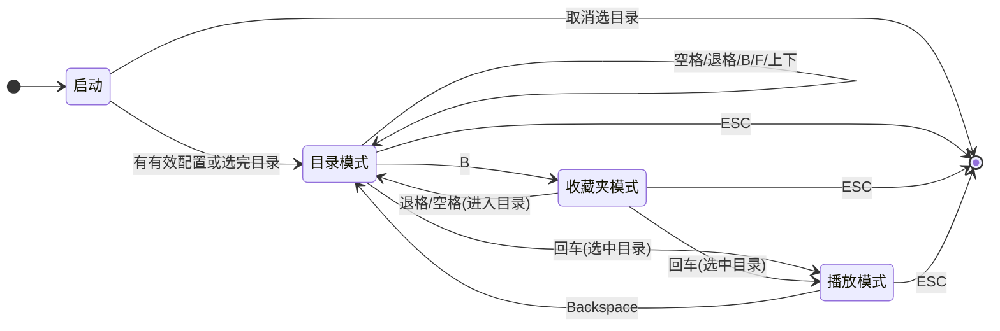

# 看图（Kantu）产品需求说明

| 项目 | 说明 |
|------|------|
| 文档版本 | 1.0 |
| 最后更新 | 2025-02 |
| 适用程序 | 看图（多模块架构版，含异步目录加载与加载动画） |

本文档面向**开发与验收**，用于实现与测试；用户操作说明可参见《看图-功能与使用说明.md》。

---

## 1. 产品概述

- **定位**：漫画/图片全屏查看器。先选择根目录，再在目录树中浏览子文件夹，选择某目录后进入全屏看图；支持在「目录选择」与「看图播放」之间来回切换。
- **目标用户**：本地或网络盘上的漫画/图片浏览者。
- **使用场景**：本地磁盘、网络映射盘（如 `Z:\`、`\\服务器\共享名`）下的目录浏览与全屏看图。

---

## 2. 用户与角色

- **角色**：读者（单一角色）。
- **前提**：具备对目标目录的读权限（本地或网络映射后可访问）。

---

## 3. 功能需求

### FR1 启动与根目录

- 若程序同目录下存在 **`kantu_config.txt`** 且第一行路径有效且为已存在目录，则**直接使用该目录进入**，不弹窗。
- 若无配置或配置为空或路径无效：弹出「选择漫画根目录」对话框；**必须**选择或输入目录并点「确定」才能进入；取消或关闭则提示并退出程序。
- 对话框支持：输入框直接输入/粘贴路径（支持本地与网络路径）；「浏览...」用系统文件夹选择器选择。
- 命令行：若启动时带一个参数且为有效目录（如 `kantu.exe D:\漫画`），仅在「需要弹窗」时作为对话框的**初始路径**；有有效配置时不会弹窗。
- 进入后将该路径写入 `kantu_config.txt`，供下次启动使用。
- 配置与收藏文件均存放在**程序/脚本所在目录**（见第 6 节）。

### FR2 目录模式

- 进入程序后首先显示「目录选择」界面，以当前根目录为基准列出可进入项。
- **列表内容**：
  - **[上一级]**：返回父目录（仅当当前不在根目录时显示）。
  - **[当前目录]**：当前目录本身（可回车进入播放）。
  - 子文件夹：按名称排序（不区分大小写）；有图片的目录显示 `[有图]`，已收藏的显示 `★`。
- **排序**：子文件夹按名称排序；收藏夹列表按显示名排序。

### FR3 收藏夹模式

- 按 **B** 进入「收藏夹」模式，列表仅显示已收藏的文件夹（来源：`kantu_favorites.txt`；不存在的目录自动过滤）。
- 在收藏夹列表中：**回车** 以当前选中项进入播放；**空格** 进入该目录并退出收藏夹模式；**退格** 退出收藏夹模式。
- 若无收藏，显示「[暂无收藏]」，此时仅可退格退出收藏夹或 ESC 退出程序。
- 收藏与目录模式共用同一套收藏数据；在目录列表中可用 **F** 对当前选中项收藏/取消收藏。

### FR4 目录与收藏夹操作（按键与鼠标）

| 按键/操作 | 功能 | 边界说明 |
|-----------|------|----------|
| **空格** | 进入当前选中项对应目录 | 收藏夹模式下进入该目录并退出收藏夹 |
| **回车** | 以当前选中目录进入播放 | 无有效路径时无效 |
| **退格** | 上一级目录 / 退出收藏夹 | 根目录下退格无效 |
| **F** | 收藏/取消收藏当前选中目录 | 仅目录模式；立即写入文件 |
| **B** | 进入收藏夹模式 | 仅目录模式 |
| **↑ / ↓** | 上下移动选中行 | - |
| **ESC** | 退出程序 | - |
| **鼠标单击** | 选中该行 | - |
| **鼠标双击** | 等同「空格」进入该目录 | 约 400ms 内两次点击视为双击 |

### FR5 播放模式（全屏看图）

- 从目录模式或收藏夹选中某目录后按回车进入该目录的「播放」界面，全屏显示图片。
- **显示方式**：单页（一屏一图，居中缩放）；双页（左右两页以屏幕中线为界并排）。**上/下方向键** 切换单页/双页。
- **翻页**：**→ / 左键** 下一页（单页 +1，双页 +2）；**← / 右键** 上一页（单页 -1，双页 -2）。
- **H**：开关 HDR 增强（亮度/对比度）。
- **Backspace**：返回目录模式（不退出程序）。
- **ESC**：退出程序。
- **界面**：右下角页码（如 `1 / 10` 或 `1-2 / 10`）；翻页或切换单/双页后左下角操作提示约 2 秒后淡出。

### FR6 响应与加载反馈

- 按键后界面在**下一帧**即有反馈（光标移动、模式切换、加载动画出现等），不因目录加载阻塞。
- 目录列表加载中（如切换目录、进入收藏夹、网络盘或大目录）时，必须显示**加载动画**（如「加载中...」+ 旋转弧），直至列表就绪。

---

## 4. 非功能需求

### NFR1 响应性

- 按键后下一帧内可见反馈。
- 目录列表加载过程中必须显示加载动画，主线程不阻塞在目录扫描上（通过异步加载实现）。

### NFR2 性能

- 支持网络映射路径；大目录下列表加载不阻塞用户输入。
- 图片解码与缩放可造成短暂卡顿，但不影响按键响应（看图模式下翻页等仍即时处理）。

### NFR3 兼容性

- Windows 下可打包为单 exe 运行。
- 支持中文路径；中文 IME 下快捷键仍生效（使用物理键/scancode）。

---

## 5. 数据与配置

| 文件 | 位置 | 格式与说明 |
|------|------|------------|
| **kantu_config.txt** | 与 exe/脚本同目录 | UTF-8；第一行为默认根目录绝对路径（normpath）。 |
| **kantu_favorites.txt** | 与 exe/脚本同目录 | UTF-8；每行一个收藏目录绝对路径（normpath），程序自动读写。 |

- 路径统一使用 `os.path.normpath` 规范化，便于与列表项比较。

---

## 6. 界面与交互汇总

- **目录界面**：深色背景（如 RGB 30,30,36）；标题与列表行；选中行高亮与边框；有图/收藏用颜色与标记区分。
- **看图界面**：黑底；单页居中或双页左右并排；页码与操作提示半透明叠加。
- **加载动画**：在目录列表区域中央显示「加载中...」及旋转弧（或等效动画），在目录加载完成前每帧更新。

---

## 7. 状态与流程

---

## 8. 验收标准

| 编号 | 检查点 |
|------|--------|
| FR1 | 有有效 kantu_config.txt 时启动不弹窗；无/无效时弹窗，取消则退出；选目录后写入配置。 |
| FR2 | 列表含上一级/当前目录/子文件夹；有图与收藏标记正确；排序符合说明。 |
| FR3 | B 进入收藏夹；退格/空格/回车行为符合说明；无收藏时显示「暂无收藏」。 |
| FR4 | 空格/回车/退格/F/B/上下/ESC/单击/双击行为与表一致；F 后收藏文件已更新。 |
| FR5 | 单页/双页切换、翻页、HDR、Backspace/ESC、页码与提示显示正确。 |
| FR6 | 目录切换或 B 进入收藏夹后，按键立即响应；加载期间出现「加载中...」动画，列表就绪后动画消失。 |
| NFR1 | 在 200+ 子目录或网络盘上，按空格进入后 1 秒内出现加载动画，列表加载完成后动画消失；期间上下键等可操作。 |
| NFR2 | 网络映射路径可正常浏览与看图。 |
| NFR3 | 中文路径正常；中文输入法下 F/B/H 等仍生效。 |

---

## 9. 依赖与约束

- **运行环境**：Python 3.x。
- **依赖**：`pygame`（>=2.5.0）、`Pillow`（>=10.0.0）；见 `requirements-kantu.txt`。
- **约束**：不新增第三方依赖（仅标准库 + 上述依赖）；Pygame 须在「选目录」完成后再初始化，避免与 tk 选目录对话框冲突。
- **启动方式**：`python kantu.py` 或 `python main.py`；可选 `python kantu.py "D:\某目录"`。打包后 `kantu.exe [初始目录]`。

---

*本文档与当前实现一致，功能或交互变更时请同步更新。*
